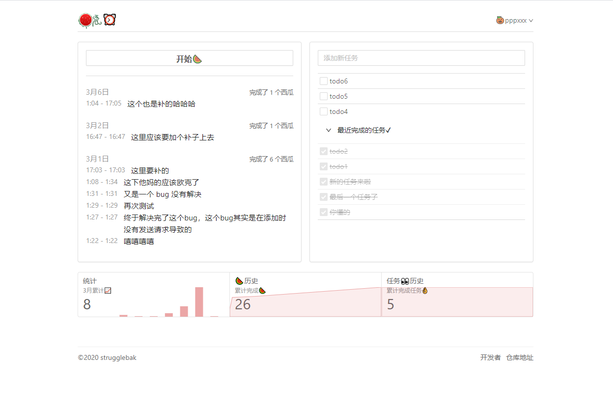
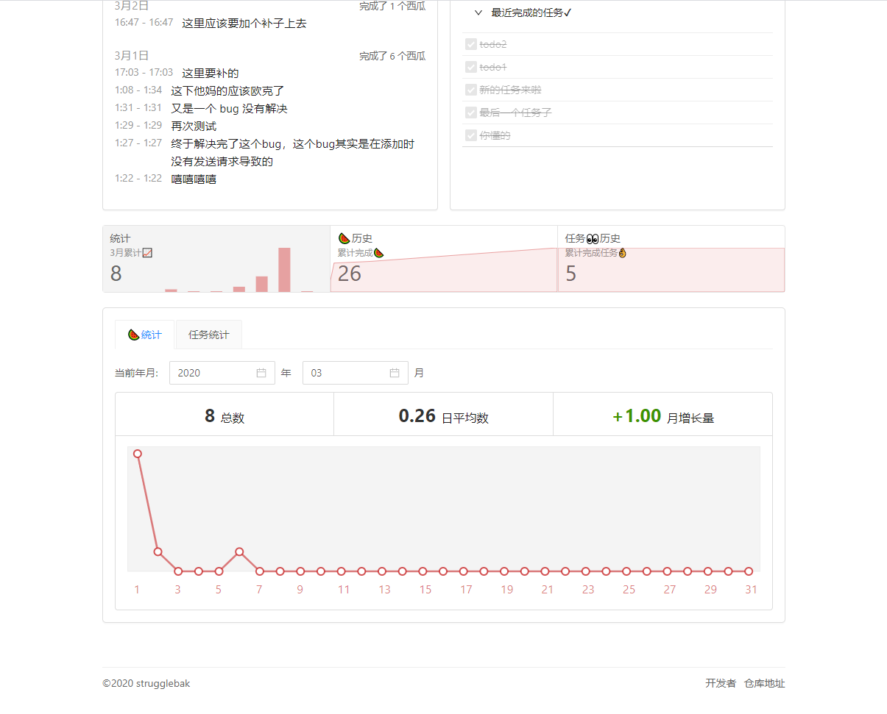
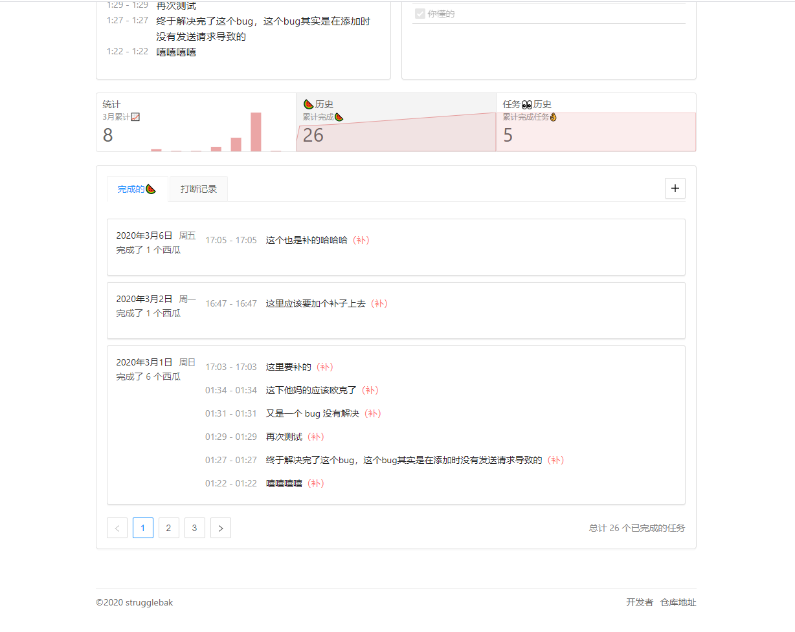
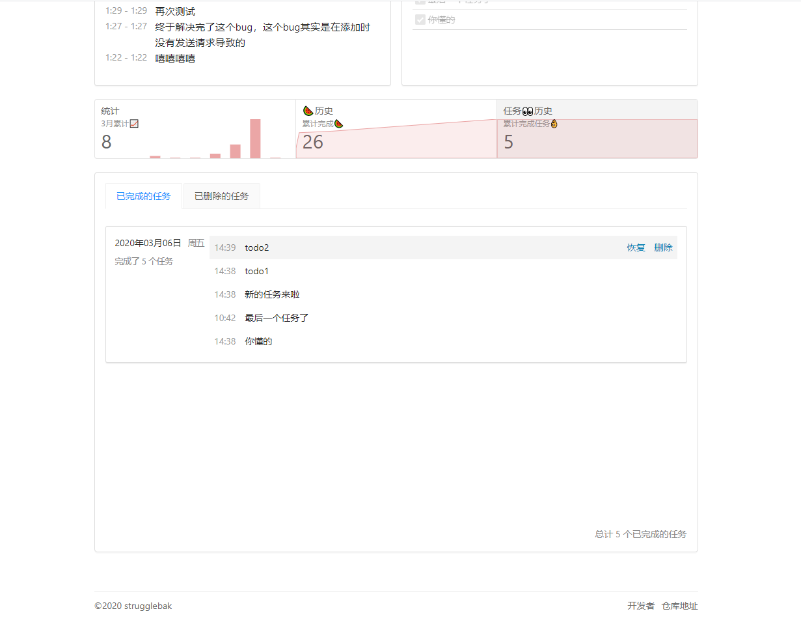
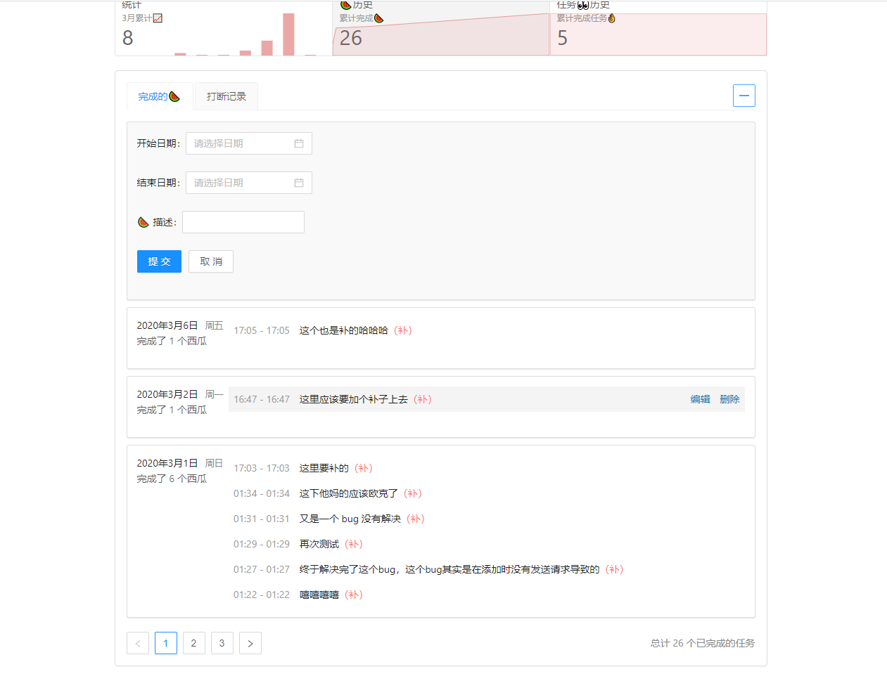

# watermelon-clock

> 这是一个🍉闹钟，可以随时用来记录你的个人计划和生活琐事哦~

> ⚠: 目前可测试账号跟密码为 `pppxxx`/`pppxxx`，有意者可以先进入页面登陆然后就可以进行预览了

## 预览

### 整体页面



### 统计组件



### 西瓜历史组件



### 任务历史组件



### 可补充西瓜组件



## 主要技术栈

- React 16.12
- antd 4.0.1
- axios 库
- react-router-dom 5.1.2
- react-redux 7.1.3
- redux 4.0.5
- typescript 3.7.2
- history 4.10.1
- lodash 4.14

## 安装

### 使用 yarn

```bash
yarn install
```

### 使用 npm

```bash
npm i -D
```

由于是使用 `create-react-app` 生成的项目，在运行命令之前可参考 `package.json` 中的 `scripts` 选项

```json
"scripts": {
  "predeploy": "yarn build",
  "deploy": "npx gh-pages -d build",
  "start": "react-app-rewired start",
  "build": "react-app-rewired build",
  "test": "react-app-rewired test",
  "eject": "react-scripts eject"
}
```

### 项目运行

```bash
yarn start
```

### 项目 build

```bash
yarn build
```

### 项目打包和部署

```bash
yarn run deploy
```

## 协议

[MIT](./LICENSE)
